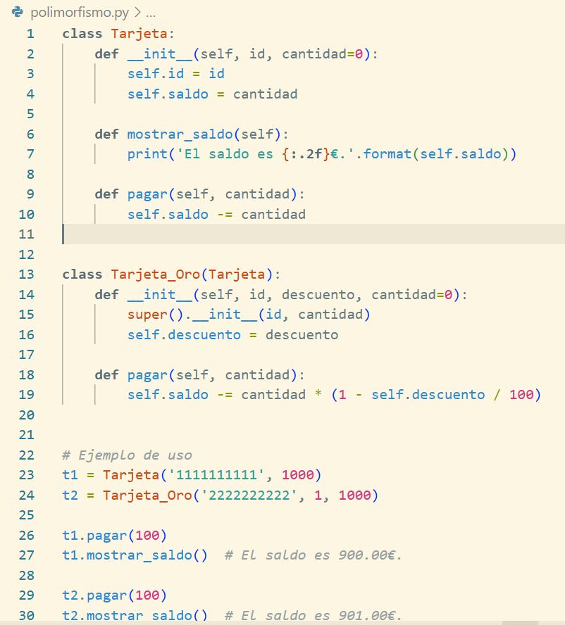

# checkpoint6
Classes en Python, Mongo, Api, Postman, poliformismo, método dunder y decorador Python


## Clases en Python

### ¿Para qué usamos clases en Python?

Usamos clases en Python para organizar el código y reutilizar el código en forma estructurada y lógica, especialmente cuando trabajamos con datos y comportamientos relacionados. Una clase nos permite:

- Crear moldes para objetos con características llamadas atributos y acciones llamadas métodos.
- Reutilizar código mediante herencia.
- Modelar problemas reales (como perros, usuarios o coches) de manera intuitiva.
- Facilitar el mantenimiento y escalabilidad de los programas.
  
### ¿Qué es una clase Python?

Una clase es una forma de agrupar datos y funciones que actúan sobre esos datos. Al definir una clase, estás creando un nuevo tipo de objeto. Por ejemplo:

~~~ python

class Perro:

    def __init__(self, nombre):
        self.nombre = nombre

    def ladrar(self):
        print(f"{self.nombre} dice ¡guau!")

~~~

Aquí `Perro`  es una clase. Cada instancia (objeto) de la clase tendrá un nombre y podrá ladrar.

### Crear instancias (objetos)

~~~ python

mi_perro = Perro("Txakur")
mi_perro.ladrar()
# Resultado: Txakur dice ¡guau!

~~~

Al crear una instancia de una clase, estamos generando un objeto concreto a partir de un molde general (la clase). En el ejemplo `mi_perro = Perro("Txakur")`, estamos creando un nuevo objeto de la clase Perro y le estamos asignando el nombre `"Txakur"`. Ese objeto ahora tiene todas las características y comportamientos definidos en la clase Perro. Al llamar al método `mi_perro.ladrar()`, se ejecuta la función definida dentro de la clase, que muestra un mensaje personalizado según el nombre del perro. En este caso, el resultado será: `Txakur dice ¡guau!`. Así, cada instancia puede comportarse de forma similar, pero con sus propios datos.
Para crear un objeto, simplemente se llama a la clase como si fuera una función, pasando los argumentos que requiere su constructor `__init__`.

### Atributos y métodos

En el ejemplo que hemos puesto, `nombre` es un atributo y `ladrar()` un método.
Una vez tenemos el objeto `mi_perro`, podemos acceder a todo su contenido, tanto métodos como atributos de clase o de instancia. Simplemente hay que usar el objeto y el método o atributo.

Veamoslo paso a paso:

- `Perro` es una clase.
- `nombre` es un atributo de instancia, es decir, una característica propia de cada objeto que creemos con esta clase
- `ladrar()`es un método, una función que pertenece a la clase y que puede ejecutar cualquier objeto crado a partir de ella.
Gracias al constructor `__init__`, cada vez que creamos un objeto nuevo de la clase `Perro`, le asignamos un nombre concreto que queda guardado en el atributo `nombre`.

**Atributo**
Un atributo es una variable que guarda información sobre el estado del objeto. En este caso, el atributo `nombre`almacena el nombre del perro. Cada objeto tendrá us propio valor para este atributo.

~~~Python

otro_perro = Perro("Lur")
print(otro_perro.nombre) #Resultado:Lur

~~~

**Metodo**
Un metodo es una función definida dentro de la clase, que puede usa o modificar los atributos objeto. En el ejemplo, el método `ladrar()` usa el atributo `nombre` para mostrar un mensaje personalizado.

Resumiendo:

- Los **atributos** son los datos que describen a un obmeto (por ejemplo, su nombre).
- Los **métodos** son las acciones que puede realizar ese objeto (por ejemplo, ladrar).
- Usamos `self` dentro de la clase para referirnos al propio objeto y acceder a sus atributos o métodos.
- Podemos crear múltiples objetos a partir de una misma clase, y cada uno puede tener valores distintos en sus atributos, pero todos compaten los mismos métodos

<p align="center">
  
</p>

### Herencia: crear una clase basada en otra

Python permite crear **clases hijas** que heredan de una **clase base**.
Cuando una clase hija se crea a partir de una clase base (o padre), **hereda automáticamente todos los atributos y métodos** definidos en esa clase base. Esto significa que la clase hija puede usar (y también modificar o extender) el comportamiento de la clase padre sin tener que volver a escribirlo.

Esto **permite reutilizar código** y organizar programas de forma más limpia y eficiente.

A partir de la clase que hemos utilizado anteriormente como ejemplo:

~~~

class Perro:

    def__init__(self, nombre):
        self.nombre = nombre

    def ladrar(self):
        print(f"{self.nombre} dice ¡guau!")
~~~

La clase hija sería la siguiente:

~~~ python

class PerroGuia(Perro):
    def guiar(self):
        print(f"{self.nombre} está guiando a su dueño.")

~~~

Aquí hemos creado una nueva clase llamada `PerroGuia` que hereda de `Perro`.
Gracias a la herencia `PerroGuia`y el método `ladrar()`sin necesidad de volver a escribirlo.
Solo añadimos un nuevo método, `guiar()`, que es específico para este tipo de perro.

**Crear una instancia de la clase hija*

~~~ python

luna = PerroGuia("Luna")
luna.ladrar()
luna.guiar()

~~~

El objeto `luna`es un PerroGuia, pero también puede hacer todo lo que un `Perro`normal puede hacer, como ladrar, y además tien su comportamiento especial de guiar.

#### Sobrescribir métodos

Cuando una clase hija hereda de una clase base, también hereda todos sus métodos. Sin embargo, a veces necesitamos que uno de esos métodos se comporte de forma diferente en la clase hija. Para ello, podemos sobrescribir (también llamado reescribir o override) el método: es decir, volver a definirlo dentro de la clase hija, con el mismo nombre, pero con un comportamiento propio.

~~~ python

class Perro:
    def __init__(self, nombre):
        self.nombre = nombre

    def ladrar(self):
        print(f"{self.nombre} dice ¡guau!")

class PerroEducado(Perro):
    def ladrar(self):
        print(f"{self.nombre} dice: 'perdón por molestar, pero... ¡guau!'")

~~~

**¿Qué está ocurriendo?**

La clase Perro define el método ladrar() con un mensaje directo.

La clase PerroEducado, que hereda de Perro, sobrescribe ese método con una versión más "educada".

Aunque ambas clases tienen un método llamado ladrar, el comportamiento será distinto dependiendo de a qué clase pertenece el objeto.

Prueba del código:

~~~ python

p1 = Perro("Txakur")
p2 = PerroEducado("Txiki")

p1.ladrar()  # Txakur dice ¡guau!
p2.ladrar()  # Txiki dice: 'perdón por molestar, pero... ¡guau!'

~~~

¿Por qué es útil sobrescribir métodos?
Permite adaptar el comportamiento sin tener que escribir toda la clase desde cero.

Facilita la extensión de clases ya existentes, respetando el principio de reutilización.

Es fundamental en patrones de diseño orientados a objetos y en programación modular.

## Método que se ejecuta automáticamente cuando se crea una instancia de una clase

En Python, el método especial `__init__` se ejecuta automáticamente cada vez que se crea una nueva instancia (objeto) de una clase. Es conocido como el **constructor**. Su función principal es **inicializar los atributos** del nuevo objeto con los valores que se le pasan al crear la instancia.

~~~ Python

class Perro:
    def __init__(self, nombre):
        self.nombre = nombre

    def ladrar(self):
        print(f"{self.nombre} dice ¡guau!")

~~~

Al crear una instancia:

~~~Python
mi_perro = Perro("Txakur")
mi_perro.ladrar()
# Resultado: Txakur dice ¡guau

~~~

- Cuando escribimos mi_perro = Perro("Txakur"), Python ejecuta el método `__init__` automáticamente.
- "Txakur" se pasa como argumento al constructor, y se guarda como el atributo `self.nombre` del objeto `mi_perro`.
- Gracias a `__init__`, el objeto se crea con su propio nombre desde el primer momento.

Este comportamiento hace que cada objeto de la clase Perro tenga su propio estado (en este caso, un nombre diferente) desde su creación.

### ¿Qué hace `self`?

Dentro del método `__init__`, usamos `self`para referirnos al objeto que se está creando.
Esto permite que cada instancia almacene sus propios valores en los atributos. Por ejemplo:

~~~ Python

self.nombre = nombre

#Significa guardar el valor como argumento en el atributo nombre del objeto actual. 

~~~

### Constructo con varios atributos

~~~ Python

class Perro:
    def __init__(self, nombre, edad):
        self.nombre = nombre
        self.edad =  edad

    def presentarse(self):
        print(f"Me llamo {self.nombre} y tengo  {self.edad} años." )

lur = Perro("Lur", 3)
lur = presentarse()

# Resultado: Me llamo Lur y tengo 3 años. 

~~~

El método `__init__`nos permite inicializar todos los atributos necesarios desde el principio, asegurando que el objeto esté completo y listo para usarse nada más crearse.

## MongoDB,  ¿una base de datos SQL o NoSQL?

MongoDB es una base de datos **NoSQL**.

Más concretamente, es una base de datos **NoSQL orientada a documentos**. En lugar de almacenar datos en tablas con filas y columnas (como en las bases de datos SQL tradicionales, como MySQL), MongoDB almacena los datos en documentos en **formtao BSON**(una forma binaria de JSON)

**Características principales de MongoDB:**

- No usa SQL: se utilizan consultas específicas con su propio lenguaje basado en JSON.
- Flexible: No requiere un esquema fijo; los documentos en una colección pueden tener estructuras diferentes.
- Escalable: Diseñada para escalar horizontalmente, ideal para aplicaciones distribuidas o con grandes volúmenes de datos.
- Orientada a documentos: cada documento puede contener datos anidados y arrays.
  
Comparemos un escenario y su equivalente en SQL. Queremos guardar información de un usuario: nombre, edad, email, dirección (calle, ciudad, código postal), lista de aficiones.

### Comparativa entre SQL y MongoDB (usuarios, direcciones y aficiones)

Mostraremos cómo realizar operaciones básicas usando las mismas estructuras de datos en SQL y MongoDB para ver cómo se representan los datos, cómo consultarlos, insertarlos y eliminarlos.

### Estructura de datos

#### En SQL usamos varias tablas relacionadas

```sql
-- Tabla usuarios
CREATE TABLE usuarios (
  id INT PRIMARY KEY,
  nombre VARCHAR(100),
  edad INT,
  email VARCHAR(100)
);

-- Tabla direcciones
CREATE TABLE direcciones (
  id INT PRIMARY KEY,
  usuario_id INT,
  calle VARCHAR(100),
  ciudad VARCHAR(50),
  codigo_postal VARCHAR(10),
  FOREIGN KEY (usuario_id) REFERENCES usuarios(id)
);

-- Tabla aficiones
CREATE TABLE aficiones (
  id INT PRIMARY KEY,
  usuario_id INT,
  aficion VARCHAR(50),
  FOREIGN KEY (usuario_id) REFERENCES usuarios(id)
);
```

#### En MongoDB se guarda todo en un único documento

```json
{
  "nombre": "Ana",
  "edad": 30,
  "email": "ana@aaa.com",
  "direccion": {
    "calle": "Calle Mayor 12",
    "ciudad": "Beasain",
    "codigo_postal": "20200"
  },
  "aficiones": ["senderismo", "lectura", "yoga"]
}
```

### Consultar la información de un usuario

#### En SQL (requiere JOIN)

Para consultar la información de un usuario con su dirección y aficiones en SQL habría que hacer un JOIN, ya que la informacióno se encuentra en diferentes tablas.

```sql
SELECT u.nombre, u.edad, u.email,
       d.calle, d.ciudad, d.codigo_postal,
       a.aficion
FROM usuarios u
JOIN direcciones d ON u.id = d.usuario_id
JOIN aficiones a ON u.id = a.usuario_id
WHERE u.nombre = 'Ana';
```

#### En MongoDB

```js
db.usuarios.find({
  nombre: "Ana"
});
```

---

### Insertar datos de un usuario completo

#### En SQL (requiere tres inserciones)

```sql
INSERT INTO usuarios (id, nombre, edad, email)
VALUES (1, 'Ana', 30, 'ana@aaa.com');

INSERT INTO direcciones (id, usuario_id, calle, ciudad, codigo_postal)
VALUES (1, 1, 'Calle Mayor 12', 'Beasain', '20200');

INSERT INTO aficiones (id, usuario_id, aficion)
VALUES 
(1, 1, 'senderismo'),
(2, 1, 'lectura'),
(3, 1, 'yoga');
```

#### En MongoDB

``` js

db.usuarios.insert({
  "nombre": "Ana",
  "edad": 30,
  "email": "ana@aaa.com",
  "direccion": {
    "calledad": "Beasain",
    "codigo_": "Calle Mayor 12",
    "ciupostal": "20200"
  },
  "aficiones": ["senderismo", "lectura", "yoga"]
});

```

### Consultas adicionales

#### Buscar solo el nombre y ciudad de una usuaria

##### SQL

``` sql

SELECT u.nombre, d.ciudad
FROM usuarios u
JOIN direcciones d ON u.id = d.usuario_id
WHERE u.nombre = 'Ana';

```

##### MongoDB

```js

db.usuarios.find(
  { nombre: "Ana" },
  { nombre: 1, "direccion.ciudad": 1 }
);

```

#### Eliminar usuarios

##### SQL

```sql

DELETE FROM usuarios
WHERE nombre = 'Ana'
LIMIT 1;

```

> Nota: `LIMIT` no es estándar en `DELETE`, pero funciona en MySQL.

##### MongoDB

```js

db.usuarios.deleteOne({ nombre: "Ana" });  // Solo uno
db.usuarios.deleteMany({ nombre: "Ana" }); // Todos los que coincidan

```

#### Comprobar si un campo existe

#### ¿Tiene dirección postal?

``` js
db.usuarios.find({ "direccion.codigo_postal": { $exists: true } });
```

#### ¿No tiene código postal?

```js
db.usuarios.find({ "direccion.codigo_postal": { $exists: false } });

```
### Ventajas y desventajas

| Característica       | SQL                                | MongoDB                             |
|----------------------|-------------------------------------|--------------------------------------|
| Estructura           | Relacional, con múltiples tablas    | Documental, con documentos JSON      |
| Flexibilidad         | Menor, requiere esquema definido    | Alta, no necesita esquema fijo       |
| Rendimiento JOIN     | Bajo con muchas relaciones          | No usa JOINs, más rápido             |
| Integridad de datos  | Alta (gracias a claves foráneas)    | Menor, se gestiona desde la app      |
| Escalabilidad        | Vertical                            | Horizontal (ideal para Big Data)     |

---

## ¿Qué es una API?

Una API (Application Programming Interface) permite que dos programas se comuniquen entre sí. Las API son mecanismos que permiten a dos componentes de software comunicarse entre sí mediante un conjunto de definiciones y protocolos. Por ejemplo, el sistema de software del instituto de meteorología contiene datos meteorológicos diarios. La aplicación meteorológica de su teléfono “habla” con este sistema a través de las API y le muestra las actualizaciones meteorológicas diarias en su teléfono.

### ¿Cómo funcionan las API?

Cuando hablamos de la estructura de las API, hablamos de cliente y servidor. En el ejemplo del instituto metereológico, la base de datos del instituto metereológico es el servidor y la aplicacioón móvil para consultar el tiempo es el cliente. 

Las API pueden funcionar de cuatro formas diferentes: 

1. **API de SOAP**: son las que utilizan el protocolo simple a objetos. El cliente y el servidor intercambian mensajes mediante XML. Estas API no son tan flexibles y han sido más populares en el pasado. 
2. **API de RPC**: son las que se denominan llamadas a procedimientos remotos. El cliente completa una función o procedimiento en el servidor, y este le devuelve el resultado al cliente. 
3. **API de WebSocket**: es otro desarrollo moderno de la API web, esta utiliza el lenguaje JSON . Este tipo de API admite la comunicación bidireccional entre las aplicaciones cliente y el servidor. Al poder enviar mensajes de devolución de llamada a los clientes conectados, es más eficiente que el API de REST. 
4. **API de REST**: son las más populares y flexibles que se encuentran actualmente en la web. El cliente envía solicitudes como datos. El servidor utiliza esta entrada del cliente para iniciar funciones interntas y devuelve los datos de salida al cliente. 
   REST significa transferencia de estado representacional. Define un conjunto de funciones como GET, PUT, DELETE, ... que los clientes pueden utilizar para acceder a los datos del servidor. Los datos entre cliente y servidor se intercambian mediante HTTP. 
   La principal característica de la API de REST es que no tiene estado. La ausencia de estado significa que los servidores no guardan los datos del cliente entre las solicitudes. Las solicitudes de los clientes al servidor son similares a las URL que se escriben en el navegador para visitar un sitio web. La respuesta del servidor son datos simples, sin la típica representación gráfica de una página web.

### ¿Cuáles son los diferentes tipos de API? 

Dependiendo de sus funciones y su ámbito de uso podemos clasificar las API de diferente manera.
Clasificandolas según el ámbito de uso los tipos de API son los siguientes: 

| Tipo de API | Descripción  |
|--------------|--------------|
|API privada   | Estas son internas de una empresa y solo se utilizan para conectar sistemas y datos dentro de la empresa.      |
|API públicas    | Están abiertas al público y pueden cualquier persona puede utilizarlas. Puede haber o no alguna autorización y coste asociado a este tipo de API.|
|API de socios | Solo pueden acceder a ellas los desarrolladores externos autorizados para ayudar a las asociaciones entre empresas.|
|API compuestas  | Estas combinan dos o más API diferentes para abordar requisitos o comportamientos complejos del sistema. 

Para saber más sobre API (puntos de conexión, cómo protegerlas, cómo crearlas, pruebas API, como utilizar una API...) puedes consultar los siguientes enlaces: 

**aws** ¿Qué es una interfaz de programación de aplicaciones (API)?|[https://aws.amazon.com/es/what-is/api/]

## Los tres verbos de API

Los verbos HTTP nos permiten:
    - Obtener información ( **GET** ). Por ejemplo, cuando entras en una página web para ver productos, tu navegardo hace una petición `GET`para que el servidor te muestre la información. 
    
`GET/usuarios`

    - Crear un nuevo recurso ( **POST** ). Se usa para enviar datos nuevos al servidor y crear algo nuevo, por ejemplo un usuario. 

`POST/usuarios`

    - Actualizar un recurso existente ( **PUT o PATCH** ). Se usan para modificar algo que ya existe. 
    `PUT`reemplaza toda la informaciòn y `PATCH` modifica solo una parte.
    Por ejemplo, cambiar el email o nombre de usuario en un perfil.

`PATCH/usuario/3`

| Verbo | ¿Qué hace?               | ¿Modifica datos? | Ejemplo                             |
|-------|--------------------------|------------------|-------------------------------------|
| GET   | Obtener información      | No               | Ver la lista de usuarios            |
| POST  | Crear un nuevo recurso   | Sí               | Crear un nuevo usuario              |
| PUT   | Reemplazar un recurso    | Sí               | Actualizar todos los datos del perfil |
| PATCH | Modificar una parte      | Sí               | Cambiar solo el email del usuario   |

## ¿Qué es Postman?

Postman es una herramienta para probar , diseñar y documentar API.
Es como un laboratorio donde enviar peticiones a un servidor y ver las respuestas, sin necesidad de escribir un programa completo.  Permite enviar solicitudes HTTP como GET, POST, PUT o DELETE y ver las respuestas del servidor.

Lo usan mucho los desarrolladores backend y frontend, testers y QA y personas que integran sistemas con API externas.

**Sin Postman** tendrías que escribir código en Python, JavaScript u otro lenguaje solo para enviar una petición HTTP, esperar la respuesta y mostrarla. Eso lleva tiempo y líneas de código.

**Con Postman** abres Postman y creas una nueva petición, seleccionas el tipo de petición (GET, POST, PUT, DELET...) y escribes la URL de la API. 


## ¿Qué es el polimorfismo?

Aunque un objeto de la clase hijo y otro de la clase padre pueden tener un mismo método, al invocar ese método sobre el objeto de la clase hijo, el comportamiento puede ser distinto a cuando se invoca ese mismo método sobre el objeto de la clase madre, tal y como lo hemos visto en herencias. Esto se conoce como **polimorfismo** y es otra de las características de la programación orientada a objetos.

<p align="center">
  
</p>

En este caso, el método se llama igual `pagar(serlf, cantida)` pero su implementación es distinta en `Tarjeta`y en `Tarjeta_oro`.
Las clase padre o base `class Tarjeta:` se define con los atributos comunes `id`, `saldo`y métodos comunes `mostrar_saldo` y `pagar`.
La clase hijo `class Tarjeta_Oro(Tarjeta):` que hereda `Tarjeta`añade un nuevo atributo `descuento`que sobrescribe el método `pagar`para aplicar el descuento. 

## ¿Qué es un método dunder?

 Dunder es la abreviatura de "double underscore/doble guión bajo".  Dunder indica al intérprete de Python que reescriba el nombre del atributo de las subclases para evitar conflictos de nombres.

 El guión bajo ayuda a escribir el código Python de forma productiva. Es un carácter único en Python.

 Algunos de los métodos dunder más conocidos son:

 | Método | Para qué sirve |
|--------------|--------------|
|`__init__`    | Inicializa una nueva instancia de una clase.      |
|`__str__`     | Daevuelve un string de un obejto, amigable para el usuario      |
|`__repr__`    | Devuelve un string de un objeto, amigable para el desarrollador    |
|`__len__`     | Devuelve la longitud de un objeto      |
|`__getitem__` |Permite acceder a elementos mediante índices      |
|`__setitem__`| Permite asignar valores a elementos mediante indices.       |
|`__iter__`    | Devuelve un iterador para el objeto      |
|`__next__`     | Devuelve el siguiente elemento del iterador      |
|`__dict__`    | Dato 5       |

Veamos cómo se implementan y utilizan algunos de estos métodos en una clase Phyton. 

|Método `__int__`
|--------------|
|El método `__int__` se utiliza para inicializar los atributos de una clase cuando se crea una nueva instancia.

```Phyton

class Persona:
    def __init__(self, nombre, edad):
        self.nombre = nombre
        self.edad = edad

persona1 = Persona("Alice", 30)
print(persona1.nombre)  # Salida: Alice
print(persona1.edad)    # Salida: 30

```

|Métodos `__str__` y `__repr__`|
|--------------|
|Los métodos `__str__` y `__repr__` devuelven representaciones en cadena de un objeto. La diferencia principal es que `__str__` está destinado a una representación amigable para el usuario, mientras que `__repr__` está orientado a los desarrolladores y debe ser más detallado.| 

```Phyton

class Persona:
    def __init__(self, nombre, edad):
        self.nombre = nombre
        self.edad = edad
    
    def __str__(self):
        return f"Persona: {self.nombre}, {self.edad} años"
    
    def __repr__(self):
        return f"Persona('{self.nombre}', {self.edad})"

persona1 = Persona("Alice", 30)
print(str(persona1))  # Salida: Persona: Alice, 30 años
print(repr(persona1)) # Salida: Persona('Alice', 30)

```
|Métodos dunder para operaciones aritméticas|
|--------------|
|Además de los métodos mencionados enla tabla, Python permite sobrecargar operadores aritméticos usando metodos dunder como ` __add__``para sumar , `__sub__` para sustraer o restar, `__mul__` para multiplicar, `__truediv__` para dividir entre otros.

*Ventajas*
Hace el código más legible y natural (trabajas con operadores en lugar de funciones).

Reduce errores porque el comportamiento está integrado en la clase.

Se puede aplicar a muchos contextos: dinero, medidas físicas, coordenadas, vectores, fechas, etc.

### ¿Qué es un decorador de python?

Un decorador Python es una función especial que sirve para modificar o añadir funcionalidad a otra función o método sin cambiar su código directamente. 

Es como una envoltura que se coloca alrededor de una función para hacer algo antes, después y en lugar de lo que esa función normalmente haría. 

Imagina que tienes una máquina de café(función prinipa) que hace café cuando pulsas el botón. 
Un decorador sería como ponerle un accesorio extra a esa máquina:
- Registra la hora cada vez que haces café. 
- Pide una contraseña antes de que empieces.
- Añade automáticamente canela después de servirlo.
La máquina (función) sigue siendo la misma, pero el accesorio (decorador) añade pasos extra.

#### Cómo funciona

En Python, un decorador:
1. Recibe una función como entrada.
2. Devuelve una nueva función que llama a la original, pero añadiendo algo antes o después. 

Se usa con la sintaxis `@nombre_decorador`justo seguido de la función que quieres modificar.

Veamoslo en un ejemplo:

```

import time

def medir_tiempo(funcion):
    def envoltura(*argumentos, **palabras_clave):
        inicio = time.time()
        resultado = funcion(*argumentos, **palabras_clave)
        fin = time.time()
        print(f"⏱ Tiempo de ejecución: {fin - inicio:.4f} segundos")
        return resultado
    return envoltura

@medir_tiempo
def tarea_pesada():
    print("Ejecutando tarea...")
    time.sleep(2)
    print("Tarea completada.")

tarea_pesada()

```
En este ejemplo `@medir_tiempo`es el decorador. 
- Recibe como parámetro la función que decorará. 
- Crea una nueva función interna (`envoltura`)
  -- Registra el tiempo antes y después.
  -- Llama a la función original.
  -- Muestra el tiempo transcurrido.
El símbolo `@medir_tiempo` indica que el decorador se aplicará a `tarea_pesada`

Cuando ejecutas el código `tarea_pesada()`en realidad está ejecuntando la versión envuelta por el decorador. 

La salida en consola sería la siguiente:

```

Ejecutando tarea...
  Tiempo de ejecución:2.0021 segundos

  ```

### Referencias

[https://docs.python.org/es/3.13/tutorial/classes.html]

[https://aprendeconalf.es/docencia/python/manual/objetos/]

[https://www.luisllamas.es/metodos-dunder-python/]

[https://www.datacamp.com/es/tutorial/role-underscore-python]

[https://aws.amazon.com/es/what-is/api/]

[https://www.datacamp.com/es/tutorial/role-underscore-python]

[https://aprendeconalf.es/docencia/python/manual/objetos/]
